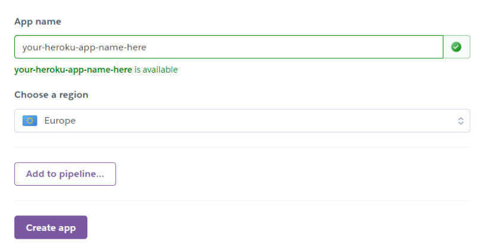

<br>

:desktop_computer: [Live Website] (https://hangmaneleanorb.herokuapp.com/)

---
## <strong>Deployment</strong>
- [Github](#ugithubu)
- [Gitpod](#ugitpodu)
- [Heroku](#uherokuu)

Days Coming was written on Gitpod and is deployed on Heroku.

--- 
 ### <u>Github</u>

This website was published using GitHub Pages.

- Navigate to [GitHub](https://github.com/) and log in.
- Navigate to your repositories and find the project you want to deploy
- Under the name of your chosen Repository you will see a ribbon of selections, click on 'Settings' located on the right hand side.
- Scroll down till you see 'Pages' heading on the left hand side
- Under the 'Source' click on the dropdown and select 'master' or 'main' branch and click save
- The page will reload and you'll see the link of your published page displayed under 'GitHub' pages.
- It takes a few minutes for the site to be published, wait until the background of your link changes to a green color before trying to open it.
- Congratulations you have deployed your project!
  
 ### <u>Gitpod</u>
 - Navigate to [Gitpod](https://gitpod.io/) through [GitHub](https://github.com/), [GitLab](https://www.gitlab.com/).
- In the browser’s address bar, prefix the entire URL with gitpod.io/# and press Enter.
- For example, gitpod.io/#https://github.com/gitpod-io/website
- We recommend you install the Gitpod browser extension to make this a one-click operation.
- Sign in with one of the listed providers and let the workspace start up.
- Congratulations, you have started your first of many ephemeral developer environments!

### <u>Heroku</u>
<u>Sign up to heroku</u>
- Navigate to [heroku](https://www.heroku.com/).
- Complete the signup form. 

<u>Setting up Heroku <i>(after login)</i></u>
- Select new+ in dashboard.
    
    
- Give your app a name, which muist be unique. 
- Select region closest to you. I chose <strong>Europe</strong>.
- When you’re done, click Create app to confirm.



- Open the Settings tab. 


- Click reveal config vars.
- Add the config var `PORT`. Set it to `8000`. 
- Add the config vars `CREDS` and paste the JSON into the value field. 

<br>
<u>Deploying to Heroku</u>

- In [gitpod](https://gitpod.io/). 

- Create a **Procfile** in the root directory to tell Heroku to create a web dyno which will run node index.js to run the JavaScript app.
```Procfile
web: node index.js
```
- We can now add and commit our changes to GitHub and push to GitHub with ```git push```.
- Then using ```git push Heroku main``` to deploy to Heroku.

The app should be deployed.

- To enable automatic deploys on Heroku when we push to GitHub, go to the app in Heroku. On the deploy tab, set it to connect to GitHub. Search for your repository and then click *connect*. Then click *Enable Automatic Deploys*.
