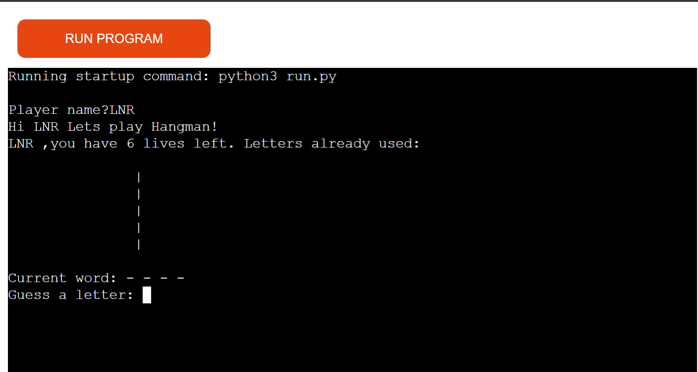
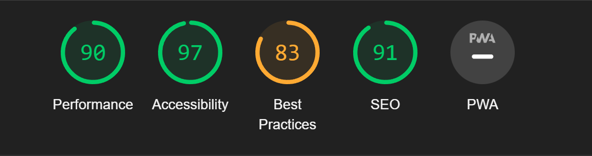

A Game of hangman against the computer, there are 385 words to guess from. There is also visual representation of a hangman based on how many times a user inputs a letter not present. The user has six attempts before the game will ask if they want to replay.  

:desktop_computer: [Live Website] (https://hangmaneleanorb.herokuapp.com/)

:open_file_folder: [Github Repository] (https://github.com/eleanorbucke21/HangMan)

## UX

### User stories

HOMEPAGE

* As a user I want the page to be easy to navigate.
* As a user I want to know what the site is about so I know what to expect from it.

# Features

## 
* The user is asked for their name.
* Names are validated, if a user enters a number they will be asked again for their name.
* It shows a visual representation of a hangman when getting words wrong.
* Users have six lives till the game ends on them if they haven't guessed the word.

# Technologies
## Languages used
- [Python](https://en.wikipedia.org/wiki/Python_(programming_language)) - 
- [JavaScript](https://en.wikipedia.org/wiki/JavaScript) - Add interactive features to web page.

## Frameworks, Libraries and Programs Used
- [Gitpod](https://gitpod.io/) - web-based editor optimised for debugging, testing, syntax highlighting and extension support

- [Git](https://git-scm.com/) - used to allow for tracking of any changes in the code and for the version control.

- [Github](https://github.com/) - used to host the project files onto the internet

- [Heroku](https://www.heroku.com/) - used to deploy and host project.

## Testing

## Lighthouse
### Index Page

## Responsiveness
 [Am I Responsive?](http://ami.responsivedesign.is/#) was used to check responsiveness of the site pages across different devices.
 
 The site has been tested on various sizes such as those listed below.
 
 Mobile:
 375x667 / 360x740 / 412x915 / 414x896
 
 Tablet:
 768x1024 / 820x1180 / 912x1368 
 
 Monitor:
 1280x1024 / 1600x900 / 2560x1440 / 3440x1440
 
 ### Manual Testing

* Browser Compatibility

     Browser | Outcome | Pass/Fail 
     --- | --- | ---
     Google Chrome | No appearance, responsiveness nor functionality issues.| Pass
     Safari | No appearance, responsiveness nor functionality issues. | Pass
     Microsoft Edge | No appearance, responsiveness nor functionality issues. | Pass
     Firefox | No appearance, responsiveness nor functionality issues. | Pass
     
 * Device compatibility

     Device | Outcome | Pass/Fail
    --- | --- | ---
    Laptop | No appearance, responsiveness nor functionality issues. | Pass
    ipad mini | No appearance, responsiveness nor functionality issues. | Pass
    Lenovo M1 Tab | No appearance, responsiveness nor functionality issues. | Pass
    Samsung s20 | No appearance, responsiveness nor functionality issues. | Pass
    iphone 12 pro | No appearance, responsiveness nor functionality issues. | Pass

### Testing

* PEP8 was deprecated so I used pycodestyle to test my code.
* I found that three of my lines of code were too long :
    * Line 36.
    * Line 50.
    * Line 52.

## Bugs

### Solved Bugs

* When testing I found that you could also enter numbers or symbols for a user name. 
* I corrected this by adding this code: 
    

## Deployment
### Gitpod
This website was written on Gitpod.
* Navigate to [Gitpod] through [GitHub](https://github.com/), [GitLab](https://www.gitlab.com/) or [Bitbucket](https://bitbucket.org/).
* In the browser’s address bar, prefix the entire URL with gitpod.io/# and press Enter.
* For example, gitpod.io/#https://github.com/gitpod-io/website.
* We recommend you install the Gitpod browser extension to make this a one-click operation.
* Sign in with one of the listed providers and let the workspace start up.
* Congratulations, you have started your first of many ephemeral developer environments!

### Heroku
This website was deploed on Heroku. 
* When you create the app, you will need to add two buildpacks from the _Settings_ tab. The ordering is as follows:

    1. `heroku/python`
    2. `heroku/nodejs`

* You must then create a _Config Var_ called `PORT`. Set this to `8000`
* If you have credentials, such as in the Love Sandwiches project, you must create another _Config Var_ called `CREDS` and paste the JSON into the value field.
* Connect your GitHub repository and deploy as normal.

## Credits 
### Content 
* YouTube tutorial [Kylie Ying](https://www.youtube.com/watch?v=cJJTnI22IF8&list=PLqoebFJFAtg940mqPamWw4_ndWbnfqFqh)
* Words from [Tom25 b](https://github.com/Tom25/Hangman/blob/master/wordlist.txt)
