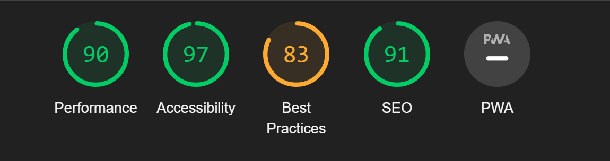

---

## TABLE OF CONTENTS

* [Automated Testing and Validation](#automated-testing-and-validation)
    * [HTML Validation](#html-validation)
    * [JavaScript Validation](#javascript-validation)
* [Lighthouse Report](#lighthouse-report)
* [Bugs, Errors & Solutions](#bugs-found-during-testing-and-development-phase)
    * [Solved Bugs](#solved-bugs)

---

## <strong>Testing</strong>
- [W3C Markup Validation Serice](https://validator.w3.org/) was used to test for error codes in the HTML.
- [JsHint](https://jshint.com/) was used to detect errors and potential problems in JavaScript code.

---

## Automated Testing and Validation
### HTML Validation
We used [W3C Markup Validation Service](https://validator.w3.org/) to validate all the HTML files by direct input:
|Page |Pass/Fail |  Results |
| ------------- | ------------- |------------- |
| Index | :heavy_check_mark: ||

---
## JavaScript Validation
We used [JSHint](https://jshint.com/) to validate all JavaScript and JQuery files

* I found that three of my lines of code were too long :
    * Line 36.
    * Line 50.
    * Line 52.

---
## Lighthouse
### Index Page

---
## Responsiveness
 [Am I Responsive?](http://ami.responsivedesign.is/#) was used to check responsiveness of the site pages across different devices.
 
 The site has been tested on various sizes such as those listed below.
 
 Mobile:
 375x667 / 360x740 / 412x915 / 414x896
 
 Tablet:
 768x1024 / 820x1180 / 912x1368 
 
 Monitor:
 1280x1024 / 1600x900 / 2560x1440 / 3440x1440
 
 ### Manual Testing

* Browser Compatibility

     Browser | Outcome | Pass/Fail 
     --- | --- | ---
     Google Chrome | No appearance, responsiveness nor functionality issues.| Pass
     Safari | No appearance, responsiveness nor functionality issues. | Pass
     Microsoft Edge | No appearance, responsiveness nor functionality issues. | Pass
     Firefox | No appearance, responsiveness nor functionality issues. | Pass
     
 * Device compatibility

     Device | Outcome | Pass/Fail
    --- | --- | ---
    Laptop | No appearance, responsiveness nor functionality issues. | Pass
    ipad mini | No appearance, responsiveness nor functionality issues. | Pass
    Lenovo M1 Tab | No appearance, responsiveness nor functionality issues. | Pass
    Samsung s20 | No appearance, responsiveness nor functionality issues. | Pass
    iphone 12 pro | No appearance, responsiveness nor functionality issues. | Pass

# Bugs

### Solved Bugs
* When testing I found that you could also enter numbers or symbols for a user name. 
* I corrected this by adding this code: 
    
